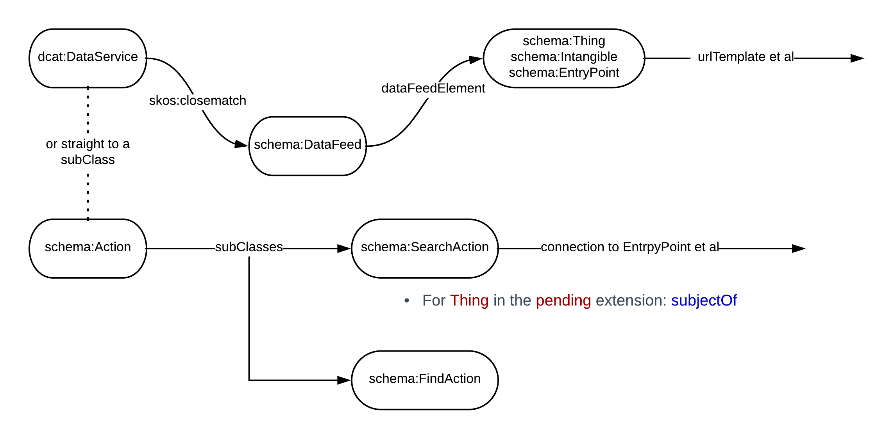
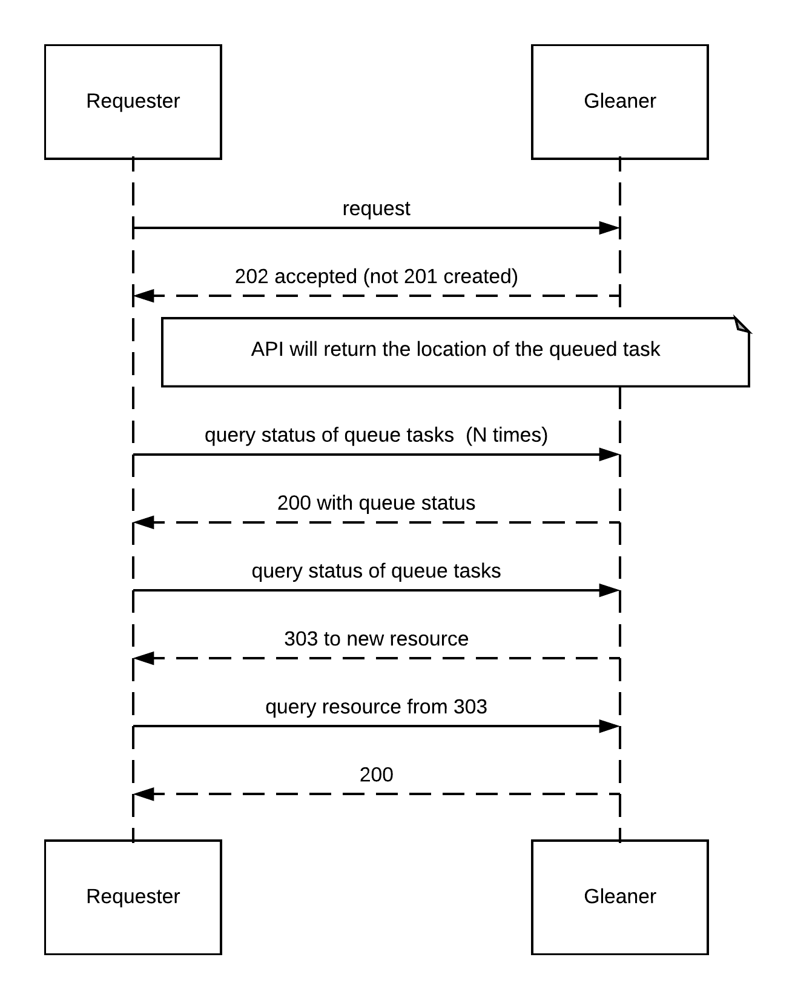

# P0, P419....  whatever...
## Update 0

.notes: Adam, Doug and Eric  December, 2018

# presenter notes 
P0 is already 2x faster than P418 (half the characters to type)

---
# Project X

* Describing services for indexing based on data and space/time elements
* Adding time to schema.org type Dataset
	* Focus on time (Geotime and OWL time)
	* tres [example markup](https://github.com/earthcubearchitecture-project418/garden/blob/master/tres/web/deeptime.html) at [repo](https://github.com/earthcubearchitecture-project418/garden/tree/master/tres)
* Merging indexes (Jena based graph leveraging Lucene)
	* spatial element exists, not tested yet
* Update P418 code base
	* Align with Go community publishing  (this work is mostly done)
	* Gleaner as a container deployable composition (need docker hub account)
	* CLI and Web UI for gleaner (gleaner as a service)
	* Gleaner web with REST task submission (gleaner will do a single request at a time)
	* fence tool (later)
* Constraint testing (nominal SHACL)
	* Can we provide assessment across providers?   Focus will be on SHACL [Test Repo](https://github.com/fils/shaclservice)
* Kubernetes deployment with scaling and monitoring 

.notes: We are mindful of existing service description approaches like SWAGGER.  However, SWAGGER lacks the ability to connect actionable semantics to the services, but a P0 approach should be orthoginal to SWAGGER and Hydra

.fx: smallest

---
# Service related development

 
Use of DCAT Dataservice and connections to schema.org

---
# Time related development

* [OWL Time](https://www.w3.org/TR/owl-time/)
* [Geologic Time](https://github.com/GeoscienceAustralia/geosciml.org/tree/master/resource/static/vocabulary/timescale)
* Interval relations (mapped to a set of SPARQL queries and exposed in a Web API)
* [CSDCO Data Dictionary](https://docs.google.com/spreadsheets/d/1MsyblEQLDQ99iOuWDDWoKI4iEuL1jgfVLsVS0iULHZo/edit?usp=sharing)
* Some private repo work on this at present.   (Publish, validate, share, link)

.fx: smallest

---
# Gleaner as a service

Initial testing on XSEDE for new index build (not the web UI element yet, just CLI)
The above sequence is how the web UI to gleaner service will be connected.

.fx: smallest

---
# Vocabulary development

* schema.org plus extensions
	* Guide the proper semantic use of the time and data and service vocabularies
	* Semantic interoperability; collaborations with ESIP, CSIRO, schema.org (DCAT) others...
* SHACL [repo](https://github.com/fils/shaclservice)
* Working close with DataONE
* Working close with ESIP Semantic Cluster

---
# Connections and Other works of note

* [Bioschemas](http://bioschemas.org/)
* [GBIF](https://www.gbif.org/) (DataONE connection here) (Darwin Core, TDWG, etc)
* [Linked Open Vocabulary](https://lov.linkeddata.es/dataset/lov/) site (make more sense later)
* [SWEET](http://sweetontology.net) 

There is also a lot of work being done in ESIP, RDA and EarthCube....  (note)

.notes:  I was too lazy to track it all down..  I'll try and add some as we go

---
# Thank you

.fx: imageslide whiteheading

---
# Extra

* then show the tree...
* then show the forrest.  (nothing connected)
* then show some points connected
* This is like scholix, this also can be shown in a geodex search
* This also leads the talk to Stonesoup

