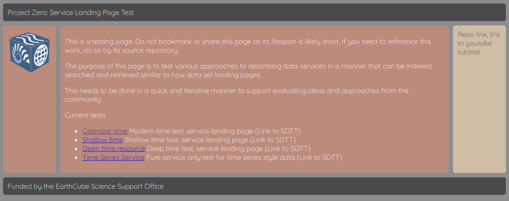
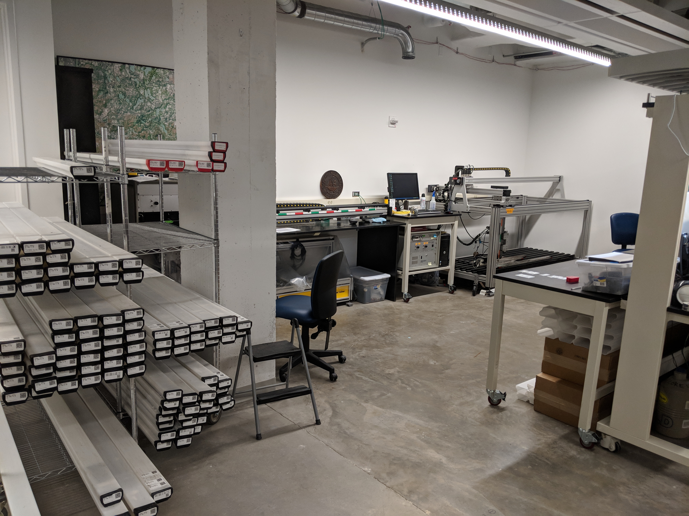

# P0, P419....  whatever...

.notes: Pressing 2 will display these notes

# presenter notes 
P0 is already 2x faster than P418 (half the characters to type)

---
# Project X

* Describing services 
* Adding time to schema.org type Dataset
* Merging indexes
* Update P418 code base
	* Align with Go community publishing 
	* Gleaner as a container deployable composition (need docker hub account)
	* CLI and Web UI for gleaner (gleaner as a service)
	* Gleaner web with REST task submission (gleaner will do a single request at a time)
	* fence tool (later)
* Constraint testing (nominal SHACL)
* Kubernetes deployment with scaling and monitoring 

.notes: Information on "fence" will come later

.fx: smaller

---
# Project X

* P418 cotinuation with refinement
* Can we index on time dimensions like we do text and spatial?
	* Focus on time (Geotime and OWL time)
	* tres [example markup](https://github.com/earthcubearchitecture-project418/garden/blob/master/tres/static/deeptime.html) at [repo](https://github.com/earthcubearchitecture-project418/garden/tree/master/tres)
* Can we describe the offerings of services like we do data sets? (note)
* Can we provide assessment across providers?   Focus will be on SHACL [Test Repo](https://github.com/fils/shaclservice)
* gleaner as a service (making geodex a tool for data providers)

.notes: We are mindful of existing service description approaches like SWAGGER.  However, SWAGGER lacks the ability to connect actionable semantics to the services, but a P0 approach should be orthoginal to SWAGGER and Hydra

.fx: smallest

---
# Vocabulary development

* schema.org plus extensions
	* [CSDCO Data Dictionary](https://docs.google.com/spreadsheets/d/1MsyblEQLDQ99iOuWDDWoKI4iEuL1jgfVLsVS0iULHZo/edit?usp=sharing)
	* Some private repo work on this at present.   (Publish, validate, share, link)
	* [Early publishing example](http://opencoredata.org/voc/csdco/v1/)
* Semantic interoperability; collaborations with ESIP, CSIRO, schema.org (DCAT) others...
* SHACL [repo](https://github.com/fils/shaclservice)

---
# Connections and Other works of note

* Working close with DataONE
* Working close with ESIP Semantic Cluster

* [Bioschemas](http://bioschemas.org/)
* [GBIF](https://www.gbif.org/) (DataONE connection here) (Darwin Core, TDWG, etc)
* [Linked Open Vocabulary](https://lov.linkeddata.es/dataset/lov/) site (make more sense later)
* [SWEET](http://sweetontology.net) 

There is also a lot of work being done in ESIP, RDA and EarthCube....  (note)

.notes:  I was too lazy to track it all down..  I'll try and add some as we go

---
# Thank you

.fx: imageslide whiteheading

---
# Extra

* then show the tree...
* then show the forrest.  (nothing connected)
* then show some points connected
* This is like scholix, this also can be shown in a 
geodex search
* This also leads the talk to Stonesoup

