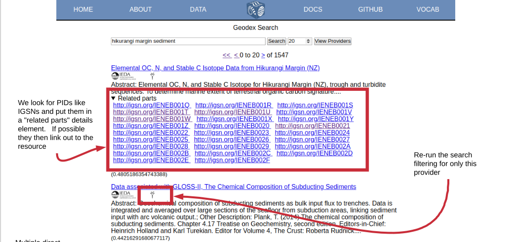
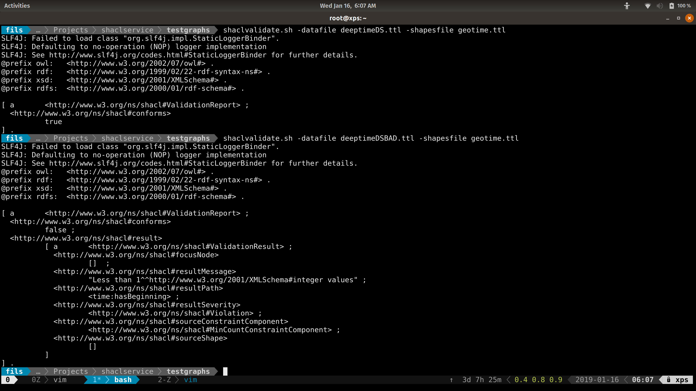

# P418/419 
## Topic: IGSN 

.notes: Adam, Doug and Eric  January, 2019

# presenter notes 
P0 is already 2x faster than P418 (half the characters to type)

---
# Points

* IGSNs as a unique ID in a search graph
* Validation (or constraint) services for a community
    * ie, how to ensure we present concepts in the graph consistently 
* Enable relation searches quickly in a collected graph

---
# Example in GeoDEX

<a target="_blank" href="https://geodex.org/?q=hikurangi+margin&n=20&s=0&i=">
https://geodex.org/?q=hikurangi+margin&n=20&s=0&i=</a>

.fx: smallest

---
# Placing IGSNs in schema.org (JSON-LD)

Examples of IGSN markup in P418 Vocabulary:
[Attaching Sample](https://github.com/earthcubearchitecture-project418/p418Vocabulary#attaching-physical-samples-to-a-datasetr)

.fx: smallest

---
# SHACL (or framing or schema?)

An approach for testing how information is represented in graphs.  Supports
better query retrieval. 

.fx: smallest

---
# Gleaner as a service

Initial testing on XSEDE for new index build (not the web UI element yet, just CLI)
The above sequence is how the web UI to gleaner service will be connected.

.fx: smallest

---
# Vocabulary development

* schema.org plus extensions
	* Guide the proper semantic use of the time and data and service vocabularies
	* Semantic interoperability; collaborations with ESIP, CSIRO, schema.org (DCAT) others...
* SHACL [repo](https://github.com/fils/shaclservice)
* Communications with DataONE
* Communications with ESIP Semantic Cluster

---
# Thank you

.fx: imageslide whiteheading

